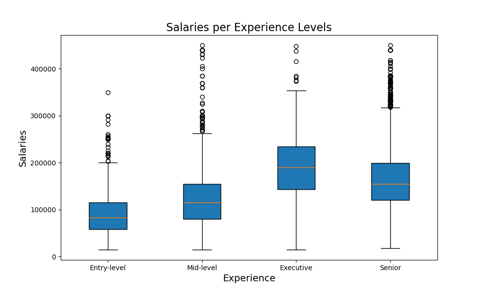

# P1Group_3
By Sean Rubin, Anna Lewis, Malek Kheirddin, Karesse Lockard, and Joseph Pequeno

Trends in Data Science

Data science is broad and in-demand field, and according to the U.S. Bureau of labor Statistics, is predicted to grow by 35% between 2022 and 2032. As emerging Data Scientists, we set out to analyze current trends in salaries for a variety of Data Science roles and find out what criteria lead to the highest paying careers. 

Data source:“Jobs and Salaries in Data field 2024” by Murilo Zangari via Kaggle.com
    (https://www.kaggle.com/datasets/murilozangari/jobs-and-salaries-in-data-field-2024)

The dataset is based on survey submissions and jobs with open salaries (https://ai-jobs.net/salaries/2024/).

The dataset we analysed contains 14,000+ rows of data covering the following:
Timeframe: 2020 -2024
Countries: 74
Salary Range: $15,000-$450,000
Experience level: Entry, Mid, Senior, Executive
Job Titles: 149
Work Setting: In-person, Remote, Hybrid

Our findings:
What data science jobs are the most popular?
    The most popular jobs titles consistantly over the last five years (2020-2024) are "Data Analyst", "Data Engineer", "Machine Learning Engineer", and "Data Scientist".

    
    
    
    
    

The graph below shows how the count of the most popular data science jobs changed over the last five years. Since this data is a small sample of all available data science jobs, this may not be representitive of the trend of the population. In this dataset, the salary information collected was greatest during 2023.

 

What Countries pay the best salaries?

The countries with the greatest average salaries are shown below:

The top five countries with the greatest number of data science jobs are show in the following bar chart:

The majority of jobs in countries with the highest average salary are found in the US and Canada. The other 18 countries with high average salaries, are represented by much smaller dataset.

How does experience influence salary?

Min to Max Ranges:
Entry Level: $15,000-$350,000
Mid Level: $15,000-$450,000
Senior Level: $18,381-$450,000
Executive Level: $15,000-$448,000

The boxplot below shows that the mean entry level salary is close to one standard deviation of the mid-level salary.

The average salaries by experience level is presented below for the top four most popular data science job titles of 2024:
{INSET SALARIES BY EXPERIENCE BAR GRAPH}

Conclusion:
Based on our review the highest paying job in the US for an entry-level position in 2024 would be Machine Learning Engineer.
The average salary of with these specific criteria is $126,118.85
For remote work, the highest paying job is Data Scientist with an average salary of $105,000.
The most popular in 2024 job was Data Scientist despite it not having the highest average salary overall.

Questions Requiring Further Analysis:
A further explanation for why there are less of the highest average paying job than others;
A further explanation of the big jump of jobs in 2023 compared to all other year that were looked at;
If the data set was biased based on a particular country, type of job, or other details of the employees surveyed;
If this data set is a good/accurate representation of the population at large.

